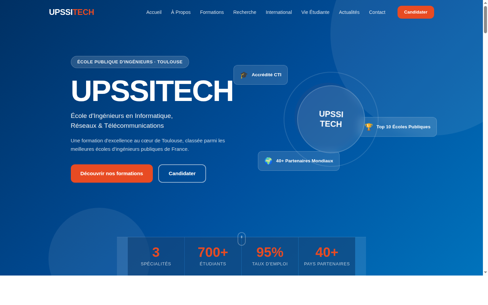

# UPSSITECH – Interactive University Website

A modern, responsive and interactive website for **UPSSITECH** – École d'Ingénieurs en Informatique, Réseaux et Télécommunications, Toulouse.



## ✨ Features

- **Fully responsive** – works on desktop, tablet and mobile
- **Interactive navigation** – sticky header with scroll-aware styles, active section highlight, and a mobile hamburger menu
- **Smooth animations** – scroll-reveal effects on every section
- **Content-driven** – all text, numbers, cards and links live in `data/content.json` – no HTML/JS knowledge required to update the site
- **Accessible** – semantic HTML5, ARIA labels, keyboard navigation, `focus-visible` styles
- **UPSSITECH brand colors** – navy blue (`#003063`), sky blue (`#0073BC`) and orange accent (`#E84B23`)

## 📁 Project Structure

```
├── index.html          # Single-page HTML shell (structure only)
├── css/
│   └── style.css       # All styles (variables, layout, components, responsive)
├── js/
│   └── main.js         # Loads content.json and renders all sections
├── data/
│   └── content.json    # ← Edit this file to update all site content
└── assets/
    └── images/         # Place images here (referenced from content.json)
```

## 🚀 Getting Started

### Run locally

No build step needed – just serve the directory with any static file server:

```bash
# Python (built-in)
python3 -m http.server 8080

# Node.js (npx)
npx serve .

# Then open http://localhost:8080 in your browser
```

### Update content

Open `data/content.json` and edit the relevant section.  
Key sections:

| Key | What it controls |
|-----|-----------------|
| `site` | School name, contact details, social links |
| `hero` | Hero title, subtitle, stats bar |
| `about` | About section text and highlight cards |
| `formations` | Program cards (title, skills, color…) |
| `recherche` | Research labs and theme tags |
| `international` | Exchange programs and partner countries |
| `studentLife` | Clubs and annual events |
| `news` | News / actualités cards |
| `contact` | Contact info cards and form subject options |
| `nav` | Navigation links |

No deployment step required – the next page load picks up your changes automatically.

## 🎨 Color Palette

| Token | Hex | Usage |
|-------|-----|-------|
| `--blue-dark` | `#003063` | Primary navy – hero, footer |
| `--blue-mid` | `#0073BC` | Secondary blue – links, accents |
| `--orange` | `#E84B23` | CTA buttons, badges, highlights |
| `--orange-light` | `#F47920` | Hover states |

## 🛠 Tech Stack

- **Vanilla HTML5 / CSS3 / ES2020** – zero runtime dependencies
- **Google Fonts** – Inter & Space Grotesk
- **IntersectionObserver** – scroll-reveal animations
- **Fetch API** – loads `content.json` at runtime

## 📄 License

MIT – see [LICENSE](LICENSE).